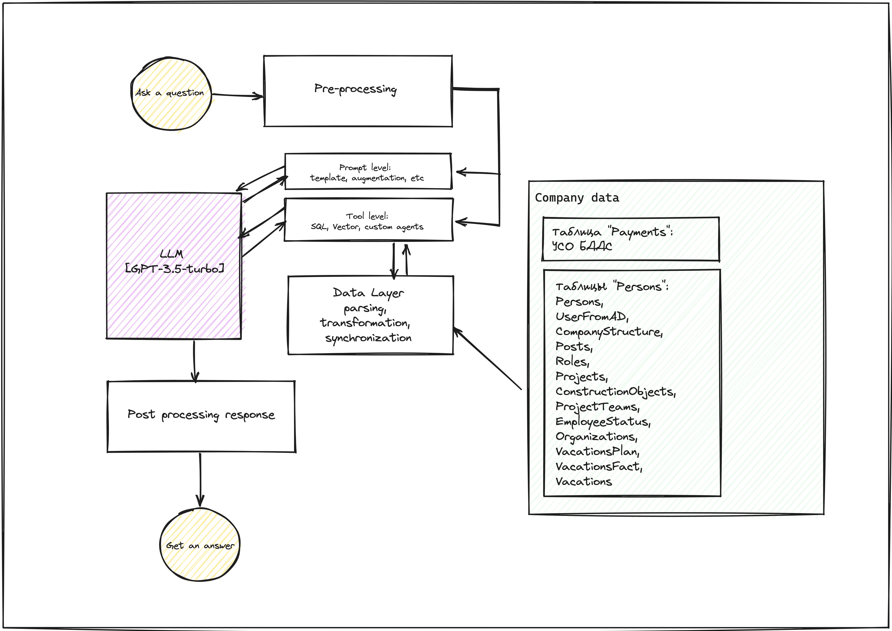
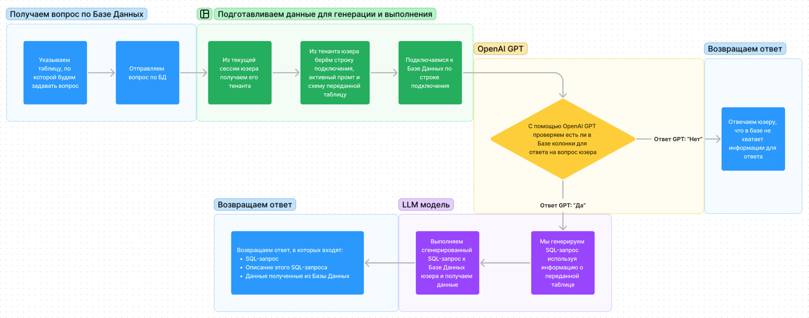

# Ассистент по базам данных

## Описание. Целевой бизнес–процесс

Сервис предназначен для обработки и предсказания данных на основе запросов к базе данных. Основной бизнес-процесс
заключается в генерации запроса, обработке и генерации предсказания на основе данных из базы данных.

> По вопросу пользователя и схеме базы данных генерирует SQL-запрос для получения нужной информации и исполняет его в
> базе данных.

## Архитектура сервиса

### High-level архитектура

### Схема информационных потоков

Сервис принимает запрос в формате `DatabasePredictionQuery`, который содержит информацию о таблицах и запросе. Затем
сервис обрабатывает запрос, используя различные **LLM компоненты**, такие как `DatastepSqlDatabase`, `DatastepSqlChain`
и `DatastepCheckDataChain`. Результаты обработки затем возвращаются в формате `DatabasePredictionRead`.

### Базы данных

Сервис использует базу данных, которая определяется в `DatastepSqlDatabase` с помощью строки подключения юзера.
Этот компонент отвечает за подключение к базе данных и выполнение SQL-запросов.

### Описание методов API

Основной метод API - `POST /assistant/prediction`, который принимает `DatabasePredictionQuery`, в котором передаются:

- `tables` - список таблиц, которые нужно использоваться
- `limit` - максимальное кол-во строк, которые будут браться из базы данных

И возвращает `DatabasePredictionRead`, в котором передаются:

- `answer` - описание сгенерированного SQL-запроса
- `sql` - сгенерированный SQL-запрос
- `table` - название таблицы, которая была использована для получения данных
- `table_source` -
- `similar_queries` - список сгенерированных вопросов похожих на запрос пользователя

### Авторизация пользователей

Этот сервис берёт **JWT токен** из активной сессии для проверки авторизованного пользователя.
На основе данных пользователя в сессии ассистент получает необходимые данные его тенанта, такие как:

- строка подключения к базе данных
- активный промпт для генерации SQL-запроса
- схему таблицы, переданной в запросе

### Используемые внешние сервисы

Данные сервис использует внешний сервис OpenAI GPT для проверки достаточности данных, для ответа на запрос пользователя

## Release Notes
