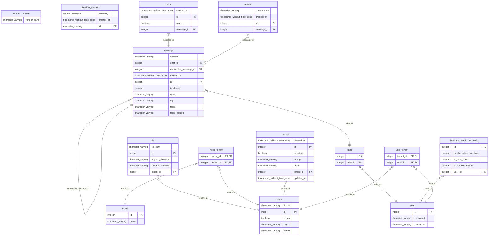

```mermaid
erDiagram
    alembic_version {
        character_varying version_num 
    }

    chat {
        integer id PK 
        integer user_id FK 
    }

    classifier_version {
        double_precision accuracy 
        timestamp_without_time_zone created_at 
        character_varying id PK 
    }

    database_prediction_config {
        integer id PK 
        boolean is_alternative_questions 
        boolean is_data_check 
        boolean is_sql_description 
        integer user_id FK 
    }

    file {
        character_varying file_path 
        integer id PK 
        character_varying original_filename 
        character_varying storage_filename 
        integer tenant_id FK 
    }

    mark {
        timestamp_without_time_zone created_at 
        integer id PK 
        boolean mark 
        integer message_id FK 
    }

    message {
        character_varying answer 
        integer chat_id FK 
        integer connected_message_id FK 
        timestamp_without_time_zone created_at 
        integer id PK 
        boolean is_deleted 
        character_varying query 
        character_varying sql 
        character_varying table 
        character_varying table_source 
    }

    mode {
        integer id PK 
        character_varying name 
    }

    mode_tenant {
        integer mode_id PK,FK 
        integer tenant_id PK,FK 
    }

    prompt {
        timestamp_without_time_zone created_at 
        integer id PK 
        boolean is_active 
        character_varying prompt 
        character_varying table 
        integer tenant_id FK 
        timestamp_without_time_zone updated_at 
    }

    review {
        character_varying commentary 
        timestamp_without_time_zone created_at 
        integer id PK 
        integer message_id FK 
    }

    tenant {
        character_varying db_uri 
        integer id PK 
        boolean is_last 
        character_varying logo 
        character_varying name 
    }

    user {
        integer id PK 
        character_varying password 
        character_varying username 
    }

    user_tenant {
        integer tenant_id PK,FK 
        integer user_id PK,FK 
    }

    chat }o--|| user : "user_id"
    message }o--|| chat : "chat_id"
    database_prediction_config }o--|| user : "user_id"
    file }o--|| tenant : "tenant_id"
    mark }o--|| message : "message_id"
    message }o--|| message : "connected_message_id"
    review }o--|| message : "message_id"
    mode_tenant }o--|| mode : "mode_id"
    mode_tenant }o--|| tenant : "tenant_id"
    prompt }o--|| tenant : "tenant_id"
    user_tenant }o--|| tenant : "tenant_id"
    user_tenant }o--|| user : "user_id"
```