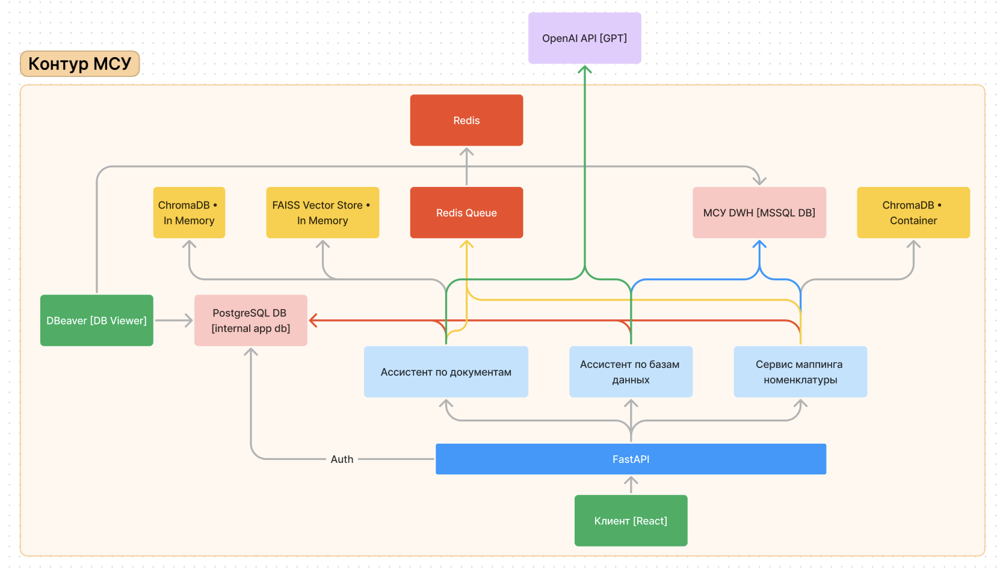

# Общая информация о проекте

## Схема информационных потоков

Контейнеры

- server
    * FastAPI приложение.
    * Порт: 8080.
    * Креды для админ–аккаунта: admin@admin.com • admin.
    * Swagger: http://<host>:8080/api/v1/docs.
    * Документация: http://<host>:8080/static/docs.
    * Имеет volume, который монтируется в /home/wv-bleschunovd/data.
    В нём лежат веса для модели–классификатора.
- rq-worker
    * Контейнер для исполнения тяжёлых задач в background режиме.
      Использует тот же image и volume, что и server контейнер.
- redis-server
    * Сервер для работы rq-worker.
    * Порт: 6379.
    * Пароля нет.
- db
    * PostgreSQL база для работы приложения.
    Диаграмма базы находится в этой документации.
    * Порт: 5432.
    * Креды для входа в базу: postgres • xPZCDU14BcAZkL.
- dbeaver
    * Просмотрщик для внутренней базы приложения. Для разработки.
    * Порт: 8000.
    * Креды для входа в базу: bleschunov • xPZCDU14BcAZkL.
- chroma-db
    * Векторстор для хранения векторов [эмбеддингов] номенклатур.
    * Порт: 8001.

Контейнеры server, rq-worker и chroma-db запускаются из docker-compose.yml в репозитории.
Перезапускаются на каждый push в репозиторий.

Контейнеры db, dbeaver, redis-server запускаются из /opt/chat-gpt-inf/docker-compose.yml.

## Сервера

Используется две тачки: продовая и для разработки [prod, dev].

Адреса:

- dev тачка: 192.168.0.238
- prod тачка: 192.168.0.176

## Описание таблиц базы данных приложения

Таблицы

- alembic_version — версия последней накатанной миграции.
- chat — чат конкретного пользователя.
- classifier_version — версии моделей–классификаторов.
- database_prediction_config — конфиг, какие этапы включать в процесс создания ответа на вопрос по базе данных.
- file — обработанные файлы для ассистента по документам.
- mark — оценка сообщения.
- message — cообщение в чате.
- mode — режим работы ассистент [базы данных, документы].
- mode_tenant — таблица многие—ко—многим для режима и тенанта.
- prompt — промпт для создания ответа ассистента по базам данных.
- review — текстовый отзыв на сообщение.
- tenant — тенант, символизирует отдел внутри компании.
- user — пользователь.
- user_tenant — таблица многие—ко—многим для тенанта и пользователя.

## Аутентификация пользователей

Аутентификация пользователей происходит через FastAPI по спецификации 
OAuth2 с использованием JWT–токенов.

Логин представляет собой email пользователя. Подтверждение почты не требуется.

Логины и пароли пользователей хранятся во внутренней базе приложения. Пароли шифруются с помощью Bcrypt.