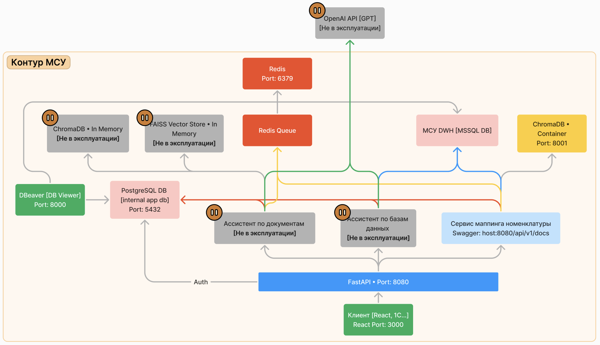

# Общая информация о проекте

## Схема информационных потоков

## Аутентификация пользователей

Аутентификация пользователей происходит через FastAPI по спецификации 
OAuth2 с использованием JWT–токенов.

Логин представляет собой email пользователя. Подтверждение почты не требуется.

Логины и пароли пользователей хранятся во внутренней базе приложения. Пароли шифруются с помощью Bcrypt.