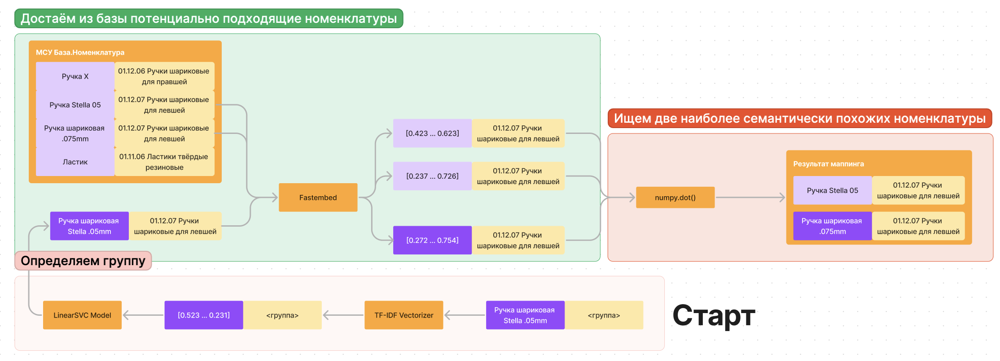
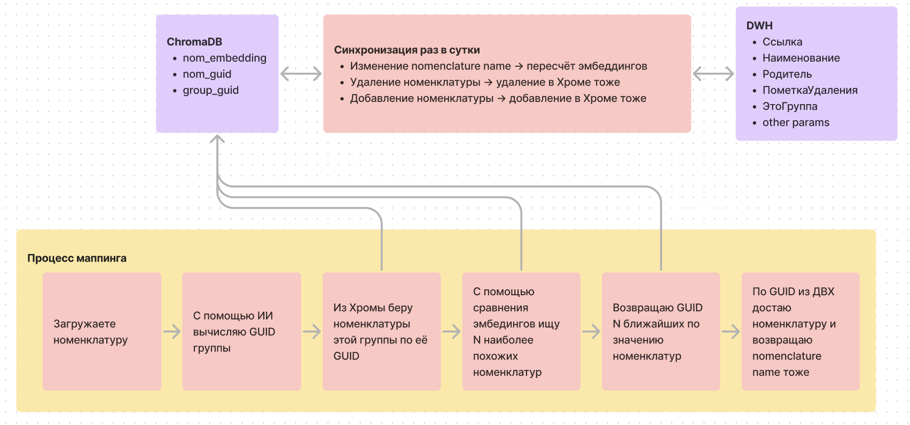

# Сервис маппинга номенклатуры

## Описание. Целевой бизнес–процесс

Веб–сервис на базе ИИ для определения товарной группы для каждой из тысяч позиций номенклатуры в базе поставщика и автоматического сопоставления строк в базах товаров поставщиков и покупателей по смыслу.

## Архитектура

### Маппинг номенклатуры

1. Через АПИ загружается номенклатура.

    Далее для каждой номенклатуры:

2. С помощь классификатора [регрессионная модель ИИ, обученная на данных МСУ] определяется, к какой группе относится номенклатура
3. По названию номенклатуры создается embedding [векторное представление номенклатуры]
4. Среди номенклатур в векторсторе, принадлежащих к нужной группе, находится ближайшая по смыслу номенклатура с помощью косинусного расстояния.

### Синхронизация номенклатуры

В векторсторе содержатся векторные представления номенклаутуры из ДВХ МСУ.
При добавлении, изменении или удалении номенклатуры в ДВХ МСУ требуется пересчитать
векторные представления для номенклатур, которых затронули изменения.

### Переобучение классификатора

После добавления или удаления групп из справочника МСУ требуется переобучение классификатора. 

## Описание методов API

Описали методы API номенклатуры в Свагере. [Ссылка на Свагер](http://45.8.98.160:8080/api/v1/docs)

## Используемые внешние продукты/сервисы

Для данного сервиса не используются внешние продукты/сервисы.

## Release Notes

### Февраль 2024
- 🔧  Разработали скрипт для созданию эмбеддингов из всех номенклатур в ДВХ МСУ
- 🔄  Разработали скрипт синхронизации номенклатуры в ДВХ МСУ 
- 🔄  Разработали скрипт для переобучения классификатора при изменении групп номенклатур в справочнике МСУ
- ✅  Написали автотесты для скрипта синхронизации номнклатур
- 📄  Создали документацию по сервису маппинга номенклатур