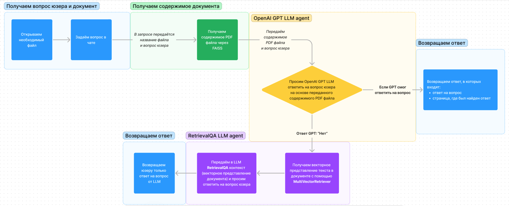

# Ассистент по документам

## Описание. Целевой бизнес–процесс

Сервис предназначен для обработки, генерации ответа на вопрос пользователя и навигации по PDF документам.
Основной бизнес-процесс заключается в обработке документа и генерации предсказания на основе информации описанной в
документе.

## Архитектура сервиса

### Схема информационных потоков

### Базы данных

Данный сервис не использует базу данных, но использует FAISS и Persist ChromaDB для хранения и преобразования
векторизованных кусочков текста и их ассоциаций.

### Описание методов API

Основной метод API - `POST /chat_pdf/prediction`, который принимает `DocumentPredictionQuery`, в котором передаются:

- `filename` - название файла в локальном пространстве
- `query` - вопрос пользователя

И возвращает `DocumentPredictionRead`, в котором передаются:

- `answer` - ответ на вопрос пользователя, на основе содержимого документа
- `page` - номер страницы, на котором был найден ответ

### Авторизация пользователей

Этот сервис берёт **JWT токен** из активной сессии для проверки авторизованного пользователя.

### Используемые внешние сервисы

Данные сервис использует внешний сервис OpenAI GPT для попытки ответа на вопрос пользователя на основе содержимого
документа.

## Release Notes

### Реализованно за 2023 год

- 📁 Сохранение загруженного файла
- ❔ Сохранение вопроса пользователя
- 🧩 Сохранение разделённого на кусочки содержимого документа в FAISS
- 🔄 Получение ответа из содержимого файла через OpenAI GPT
- ↗️ Получение ответа из векторного представления содержимого документа через **RetrievalQA** и **ChromaDB**
